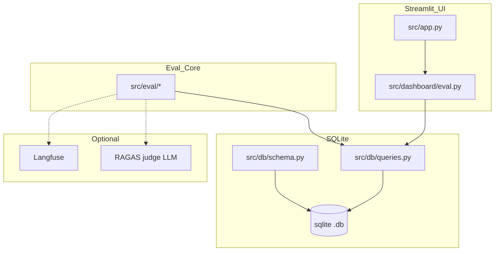

# M003: Dashboard Evaluation and Polish

**Vision:** Make the Streamlit dashboard demo-ready by implementing a real evaluation harness (extraction plus retrieval and RAG) backed by SQLite run history, plus visible UI polish and safe empty states so a compliance officer can trust and compare system quality over time.

## Success Criteria

- Eval tab shows real metrics for extraction and retrieval or RAG from SQLite-backed run history.
- At least two runs can be compared in the dashboard (same type or across types).
- No crashes on missing prerequisites (no gold set, no eval runs, no retrieval index, no provider config).

## Slices

- [x] **S01: S01** `risk:High: the gold-set schema and run storage contract are currently missing or underspecified; getting this wrong blocks metric computation and UI rendering.` `depends:[]`
  > After this: Create or upgrade SQLite schema to include gold labels plus eval run tables, and add query helpers that can insert and list eval runs and metrics without Streamlit rerun duplication.

- [x] **S02: S02** `risk:Medium: metric definitions and normalization rules can be contentious; must be deterministic and testable to be credible.` `depends:[]`
  > After this: Given gold extraction labels and predicted extraction rows in SQLite, compute per-field precision, recall, and F1 and persist an extraction eval run with summary metrics.

- [x] **S03: S03** `risk:High: touches multiple systems (retrieval index, RAG generation outputs, optional Langfuse); must degrade gracefully when data is missing.` `depends:[]`
  > After this: Compute retrieval recall at 5 and 10 and basic citation accuracy against a gold query set; when optional trace metadata exists, attach latency and cost summaries; persist a retrieval or RAG eval run to SQLite.

- [x] **S04: S04** `risk:Medium: UI must avoid heavy computation on rerun and must not crash when prerequisites are missing.` `depends:[]`
  > After this: Open Streamlit and see a populated Eval tab listing eval runs and metrics, with the ability to select and compare two runs and clear guidance for missing gold and evals.

- [x] **S05: S05** `risk:Low-medium: mostly UX work but can accidentally regress existing tabs if done carelessly.` `depends:[]`
  > After this: Dashboard layout, typography, and table presentation feel demo-ready; Eval tab is readable and consistent with Compliance and Chat sections.

- [x] **S06: Complete R007 metric coverage** `risk:High: touches metric semantics, optional RAGAS or trace data, and requirement R007 completeness.` `depends:[S05]`
  > After this: After this: Evaluation run history includes repeatable faithfulness or relevancy, citation, latency, and cost metrics where prerequisites are configured, with deterministic fallback behavior and tests when optional services are absent.

- [ ] **S07: Implement R008 Langfuse tracing** `risk:High: cross-pipeline observability can leak sensitive data if sanitization boundaries are not enforced.` `depends:[S05]`
  > After this: After this: Langfuse tracing spans cover ingestion, extraction, retrieval, generation, and evaluation without leaking secrets, and tests or fixture traces prove evaluation can surface latency and cost summaries.

- [ ] **S08: Record Eval tab UAT evidence** `risk:Medium: depends on remediation data being present and requires runtime evidence rather than unit tests only.` `depends:[S06,S07]`
  > After this: After this: A recorded dashboard walkthrough proves the Eval tab shows at least one run and metrics, compares two runs, and displays actionable messaging for a fresh DB without crashing.

## Boundary Map

